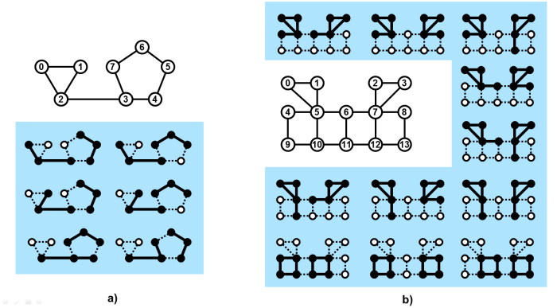

# PAL_Smugglers_vs_Detectives

The detectives from law enforcement company Catch&Jail Ltd. investigate a group of smugglers. The detectives compiled an investigation list of these individuals. Before they crack down on the suspects they want to extract as much knowledge as possible from the information already available to the company.
A new criminal syndicate operates in the area and their people are organized into so called packs. The detectives are sure there are members of two packs in their list of suspects.

The following information is known to the detectives.

Any two members of the syndicate are either connected or not. The pair of members who are connected communicate regularly and know each other, the pair who is not connected does not communicate, and the two individuals do not meet each other at all.
The structure of all packs is identical, in the sense described below.
No person can be a member of two or more packs.
A pack is connected. It means that some members of the pack might not be connected, however there is a always a sequence of connections which leads from a member of the pack to any other member of the same pack. A sequence of connections is a sequence of persons P1, P2 P3, P4, ..., etc, such that there is a connection between P1 and P2, a connection between P2 and P3, between P3 and P4 etc. There can be even more than one sequence of connections between two members of a pack.
All connections between the pairs of individuals in the detectives' list.
The number P of members of a pack and the number C of all connections between the members of a pack.
Identity of pack structure.
Let there be two packs. Whenever members of one pack are listed in an arbitrary but fixed order then the members of the other pack can be listed in such order that the following is true:
For any two different positions, say p1 and p2 in the first list, it holds
the pair of members of the first pack at positions p1 and p2 are connected if and only if the pair of members of the second pack at the same positions in the other list is connected too.

The detectives hope they can identify two packs in their list of suspects. However, because of the incomplete knowledge, they first need to produce a set of all possible pairs of packs in their investigation list.

Figure 1. Schemes of connections between pairs of suspects in the investigation list. In case a), the list contains 8 individuals with 9 connections between some of them. In case b), the list contains 14 individuals with 19 connections between some of them. The smaller highlighted schemes, in each of the cases, present all possible pairs of packs in the given list. The members of the packs are shown as black dots and the connections between them are shown as thick lines. The values of P and C, respectively, are 3 and 2 in case a) and 4 and 4 in case b). The schemes correspond to Examples 1 and 2 below.